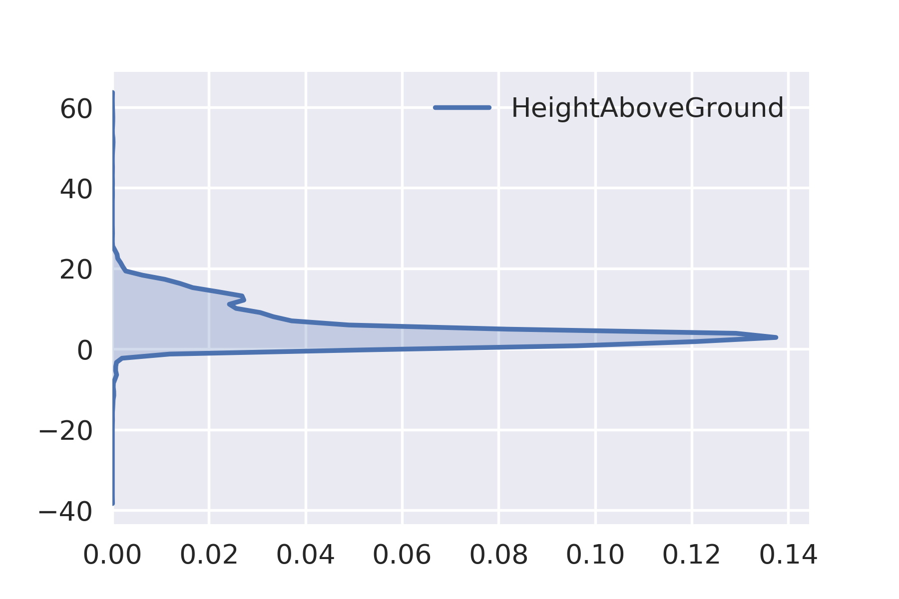

---

### Point Cloud Filters & Pipelines in PDAL
#### FOSS4G 2017, 18 August 2017
Bradley J Chambers, DigitalGlobe

---

### Overview

* Python Package
* Docker Images
* IPython/Jupyter Examples
* Status of PCL Filters
* Filter-only Pipelines

---

### Python Package

* The PDAL Python [package](https://pypi.python.org/pypi/PDAL) can be installed via [pip](https://pip.pypa.io/en/stable/).

  `pip install pdal`

* Once installed, simply

  ```python
  import pdal
  ```

---

### Docker Image

* Existing PDAL image (`pdal/pdal:latest`) approaches 4 GB
* Images building plugins on top of the PDAL base image can grow even larger

<table style="font-size:100%;">
  <tr>
    <th style="text-align:left;">Image</th>
    <th style="text-align:left;">Tag</th>
    <th style="text-align:left;">Size</th>
  </tr>
  <tr>
    <td style="text-align:left;">pdal/dependencies</td>
    <td style="text-align:left;">1.5</td>
    <td style="text-align:left;">3.1GB</td>
  </tr>
  <tr>
    <td style="text-align:left;">pdal/dependencies</td>
    <td style="text-align:left;">latest</td>
    <td style="text-align:left;">3.31GB</td>
  </tr>
  <tr>
    <td style="text-align:left;">pdal/pdal</td>
    <td style="text-align:left;">1.5</td>
    <td style="text-align:left;">3.67GB</td>
  </tr>
  <tr>
    <td style="text-align:left;">pdal/pdal</td>
    <td style="text-align:left;">latest</td>
    <td style="text-align:left;">3.67GB</td>
  </tr>
</table>

+++

### Alpine Docker Image

* Prototype Alpine image with ~80% of the plugins is currently under 400 MB

<table style="font-size:100%;">
  <tr>
    <th style="text-align:left;">Image</th>
    <th style="text-align:left;">Tag</th>
    <th style="text-align:left;">Size</th>
  </tr>
  <tr>
    <td style="text-align:left;">pdal/dependencies</td>
    <td style="text-align:left;">alpine</td>
    <td style="text-align:left;">1.07GB</td>
  </tr>
  <tr>
    <td style="text-align:left;">pdal/pdal</td>
    <td style="text-align:left;">alpine</td>
    <td style="text-align:left;">365MB</td>
  </tr>
</table>

+++

### `pdal-notebook` Docker Image

* `pdal/pdal` image has existed for some time
* Rational for `pdal-notebook` is to layer on all the necessary pieces to be able to use PDAL and the PDAL python package within a Jupyter notebook, with some extra goodies

---

### IPython/Jupyter Examples

The remainder of the presentation will leverage our `pdal-notebook` and present examples in the context of the PDAL Python package (though CLI samples will be provided as well).

---

### Creating a Pipeline

+++?gist=1ef09c4a643dad8221452c63b2e55905

---

### Validating & Executing the Pipeline

+++?gist=5a305b98ceb5aa7e59b114f7382ae26a

---

### Use the `ndarray`

+++?gist=e603131cb635f2b82377e95c0d23f7b0

---

### Or Pandas!

+++?gist=c57ae3d82026dad87009a8e6c7e4ae0f

---

### Analyze

+++?gist=9f34a474e98e4498e5f8ed414a831333

---

### Searching Near a Point

+++?gist=d2b38485dfc4ba3e8463ffc894408838

---

### DimRange

* A [DimRange](https://www.pdal.io/stages/filters.range.html#ranges) is a
  * named dimension, and 
  * range of values.
* Bounds can be inclusive (`[]`) or exclusive (`()`).
* Ranges can be negated (`!`).

+++

For example,
* `Z[10:]` selects all points with Z greater than or equal to 10
* `Classification[2:2]` selects all points with classification of 2
* `Red!(20:40]` selects all points with red values less than or equal to 20 as well as those with values greater than 40

+++

Commonly used in both `filters.range`


```json
{
  "pipeline":[
    {
      "type":"filters.range",
      "limits":"Z[10:]"
    }
  ]
}
```

+++

and `filters.assign`.


```json
{
  "pipeline":[
    {
      "type":"filters.assign",
      "assignment":"Classification[:]=0"
    }
  ]
}
```

---

### Ignore

Two of PDAL's ground segmentation filters, `filters.pmf` and `filters.smrf`, can now specify a `DimRange` via the `ignore` parameter to specify points that should be ignored during processing.

A common use case for this is to ignore points that have been previously marked as noise. In prior versions of PDAL, we had to filter noise out completely prior to ground segmentation.

```json
{
  "pipeline":[
    {
      "type":"filters.range",
      "limits":"Classification![7:7]"
    },
    {
      "type":"filters.smrf"
    }
  ]
}
```

Which of course means those noise points are gone forever.

+++

Now, with `ignore` we can


```json
{
  "pipeline":[
    {
      "type":"filters.smrf",
      "ignore":"Classification[7:7]"
    }
  ]
}
```

Which allows us to retain noise points without having them impact the ground segmentation step.

---

### Height Above Ground

To compute `HeightAboveGround` we will use two PDAL filters, first [SMRF](https://pdal.io/stages/filters.smrf.html) to segment ground and non-ground returns, and [HAG](https://pdal.io/stages/filters.hag.html) to estimate the `HeightAboveGround` using the return information.

Recall the kernel density of raw elevations...

+++?gist=aded19784be1dcddd0a4e1fcd88939d6

---

Now, consider the `HeightAboveGround` dimension.

+++?gist=50a68491ee0115d825fa72d313e4a7fe

---

Exclude ground returns (HAG=0, by definition).

+++?gist=efa93860aa316f607ea4b3215395f627

---

A small test.

<iframe src="https://gist.github.com/chambbj/aded19784be1dcddd0a4e1fcd88939d6.js"></iframe>

+++?gist=a5d9b3f40d13d19276b1b7a31f806393

---



---

```python
json = u'''
{
  "pipeline":[
    "./data/isprs/samp11-utm.laz",
    {
      "type":"filters.elm"
    },
    {
      "type":"filters.range",
      "limits":"Classification![7:7]"
    },
    {
      "type":"filters.smrf"
    },
    {
      "type":"filters.hag"
    },
    {
      "type":"filters.range",
      "limits":"Classification[1:1]"
    }
  ]
}'''

p = pdal.Pipeline(json)
count = p.execute()
df = pd.DataFrame(p.arrays[0])
```


```python
sns.kdeplot(df['HeightAboveGround'], cut=0, shade=True, vertical=True);
```


```python
df[['HeightAboveGround']].describe()
```


<div>
<style>
    .dataframe thead tr:only-child th {
        text-align: right;
    }

    .dataframe thead th {
        text-align: left;
    }

    .dataframe tbody tr th {
        vertical-align: top;
    }
</style>
<table border="1" class="dataframe">
  <thead>
    <tr style="text-align: right;">
      <th></th>
      <th>HeightAboveGround</th>
    </tr>
  </thead>
  <tbody>
    <tr>
      <th>count</th>
      <td>15607.000000</td>
    </tr>
    <tr>
      <th>mean</th>
      <td>5.467956</td>
    </tr>
    <tr>
      <th>std</th>
      <td>5.006438</td>
    </tr>
    <tr>
      <th>min</th>
      <td>-13.280000</td>
    </tr>
    <tr>
      <th>25%</th>
      <td>2.110000</td>
    </tr>
    <tr>
      <th>50%</th>
      <td>3.870000</td>
    </tr>
    <tr>
      <th>75%</th>
      <td>7.810000</td>
    </tr>
    <tr>
      <th>max</th>
      <td>63.700000</td>
    </tr>
  </tbody>
</table>
</div>


<h3 align="center">Removing Noise</h3>

This tutorial is meant to walk through the use of and theory behind PDAL's `outlier` filter.

- Statistical Outlier Filter
- Radius Outlier Filter

<h4 align="center">Statistical Outlier Filter</h4>

The basic idea of a statistical outlier removal has been implemented in both [PCL](http://www.pointclouds.org/documentation/tutorials/statistical_outlier.php#statistical-outlier-removal) and [PDAL](https://www.pdal.io/stages/filters.outlier.html).

We begin by computing the mean distance $\mu_i$ to each of the $k$ nearest neighbors for each point.

Next, we use the pointwise mean distances to compute the global mean

$$\overline{\mu} = \frac{1}{N} \sum_{i=1}^N \mu_i$$

and standard deviation

$$\sigma = \sqrt{\frac{1}{N-1} \sum_{i=1}^N (\mu_i - \overline{\mu})^2}$$

A threshold is then formed by

$$\overline{\mu} + 3\sigma$$

Any point whose mean distance $\mu_i$ exceeds this threshold is then labeled as noise.

Let's begin by iterating through our DataFrame, keeping track of the mean distance to our eight nearest neighbors.


```python
import numpy as np
dists = []
for _, point in samp11[['X','Y','Z']].iterrows():
    dist, _ = tree.query(point, k=9)
    dists = np.append(dists, dist[1:].mean())
```

The KDE plot of the mean distances looks something like this.


```python
sns.kdeplot(dists, cut=0, shade=True);
```


Now, we compute the threshold as described.


```python
threshold = dists.mean()+3*dists.std()
noise = dists[dists>threshold]
signal = dists[dists<=threshold]
print(noise.size, "points detected with a "
      "mean distance exceeding the global threshold of", threshold)
```

    241 points detected with a mean distance exceeding the global threshold of 3.81763516967


Now our KDE plot of mean distances looks like this.


```python
sns.kdeplot(signal, cut=0, shade=True);
```


```python
!pdal translate ./data/isprs/samp11-utm.laz ./data/foo.laz assign outlier \
  --filters.assign.assignment="Classification[:]=0" \
  --filters.outlier.method="statistical" \
  --filters.outlier.multiplier=3 \
  --filters.outlier.mean_k=8 \
  --verbose 5
```

    (pdal translate filters.outlier Debug) 		Labeled 241 outliers as noise!
    (pdal translate writers.las Debug) Wrote 38010 points to the LAS file


```python
json = u'''
{
  "pipeline":[
    "./data/isprs/samp11-utm.laz",
    {
      "type":"filters.assign",
      "assignment":"Classification[:]=0"
    },
    {
      "type": "filters.outlier",
      "method": "statistical",
      "multiplier": 3,
      "mean_k": 8
    }
  ]
}'''

p = pdal.Pipeline(json)
p.loglevel = 8
p.execute()
print(p.log)
```

    (pypipeline filters.outlier Debug) 		Labeled 241 outliers as noise!
    


```python
json = u'''
{
  "pipeline": [
    "./data/isprs/samp11-utm.laz",
    {
      "type": "filters.smrf"
    },
    {
      "type": "filters.hag"
    },
    {
      "type": "filters.range",
      "limits": "HeightAboveGround[3:]"
    },
    {
      "type": "filters.cluster",
      "tolerance": 3
    },
    {
      "type": "filters.groupby",
      "dimension": "ClusterID"
    },
    {
      "type": "filters.locate",
      "dimension": "HeightAboveGround",
      "minmax": "max"
    },
    {
      "type": "filters.merge"
    },
    {
      "type": "filters.range",
      "limits": "HeightAboveGround[20:]"
    }
  ]
}

'''
p = pdal.Pipeline(json)
p.execute()
vo = pd.DataFrame(p.arrays[0], columns=['X','Y','Z','HeightAboveGround'])
```


```python
vo.describe()
```


<div>
<style>
    .dataframe thead tr:only-child th {
        text-align: right;
    }

    .dataframe thead th {
        text-align: left;
    }

    .dataframe tbody tr th {
        vertical-align: top;
    }
</style>
<table border="1" class="dataframe">
  <thead>
    <tr style="text-align: right;">
      <th></th>
      <th>X</th>
      <th>Y</th>
      <th>Z</th>
      <th>HeightAboveGround</th>
    </tr>
  </thead>
  <tbody>
    <tr>
      <th>count</th>
      <td>15.000000</td>
      <td>1.500000e+01</td>
      <td>15.000000</td>
      <td>15.000000</td>
    </tr>
    <tr>
      <th>mean</th>
      <td>512799.513333</td>
      <td>5.403632e+06</td>
      <td>352.667333</td>
      <td>38.212000</td>
    </tr>
    <tr>
      <th>std</th>
      <td>23.111817</td>
      <td>4.812817e+01</td>
      <td>22.661835</td>
      <td>16.576486</td>
    </tr>
    <tr>
      <th>min</th>
      <td>512730.790000</td>
      <td>5.403557e+06</td>
      <td>317.300000</td>
      <td>20.050000</td>
    </tr>
    <tr>
      <th>25%</th>
      <td>512795.435000</td>
      <td>5.403623e+06</td>
      <td>333.970000</td>
      <td>21.895000</td>
    </tr>
    <tr>
      <th>50%</th>
      <td>512798.290000</td>
      <td>5.403624e+06</td>
      <td>354.110000</td>
      <td>38.450000</td>
    </tr>
    <tr>
      <th>75%</th>
      <td>512813.460000</td>
      <td>5.403626e+06</td>
      <td>367.255000</td>
      <td>54.255000</td>
    </tr>
    <tr>
      <th>max</th>
      <td>512831.280000</td>
      <td>5.403739e+06</td>
      <td>401.930000</td>
      <td>63.700000</td>
    </tr>
  </tbody>
</table>
</div>


```python
vo
```


<div>
<style>
    .dataframe thead tr:only-child th {
        text-align: right;
    }

    .dataframe thead th {
        text-align: left;
    }

    .dataframe tbody tr th {
        vertical-align: top;
    }
</style>
<table border="1" class="dataframe">
  <thead>
    <tr style="text-align: right;">
      <th></th>
      <th>X</th>
      <th>Y</th>
      <th>Z</th>
      <th>HeightAboveGround</th>
    </tr>
  </thead>
  <tbody>
    <tr>
      <th>0</th>
      <td>512794.22</td>
      <td>5403576.38</td>
      <td>317.30</td>
      <td>21.99</td>
    </tr>
    <tr>
      <th>1</th>
      <td>512827.97</td>
      <td>5403630.85</td>
      <td>329.92</td>
      <td>24.45</td>
    </tr>
    <tr>
      <th>2</th>
      <td>512786.89</td>
      <td>5403626.56</td>
      <td>366.60</td>
      <td>58.15</td>
    </tr>
    <tr>
      <th>3</th>
      <td>512811.06</td>
      <td>5403612.84</td>
      <td>326.88</td>
      <td>20.26</td>
    </tr>
    <tr>
      <th>4</th>
      <td>512792.11</td>
      <td>5403626.03</td>
      <td>368.89</td>
      <td>59.78</td>
    </tr>
    <tr>
      <th>5</th>
      <td>512797.05</td>
      <td>5403624.26</td>
      <td>338.02</td>
      <td>28.91</td>
    </tr>
    <tr>
      <th>6</th>
      <td>512796.65</td>
      <td>5403624.90</td>
      <td>350.39</td>
      <td>41.28</td>
    </tr>
    <tr>
      <th>7</th>
      <td>512798.29</td>
      <td>5403625.87</td>
      <td>361.53</td>
      <td>52.31</td>
    </tr>
    <tr>
      <th>8</th>
      <td>512797.34</td>
      <td>5403623.67</td>
      <td>347.56</td>
      <td>38.45</td>
    </tr>
    <tr>
      <th>9</th>
      <td>512798.47</td>
      <td>5403623.67</td>
      <td>354.11</td>
      <td>44.89</td>
    </tr>
    <tr>
      <th>10</th>
      <td>512798.73</td>
      <td>5403624.20</td>
      <td>365.42</td>
      <td>56.20</td>
    </tr>
    <tr>
      <th>11</th>
      <td>512831.28</td>
      <td>5403557.39</td>
      <td>323.52</td>
      <td>20.96</td>
    </tr>
    <tr>
      <th>12</th>
      <td>512815.86</td>
      <td>5403621.44</td>
      <td>370.03</td>
      <td>63.70</td>
    </tr>
    <tr>
      <th>13</th>
      <td>512815.99</td>
      <td>5403739.10</td>
      <td>367.91</td>
      <td>20.05</td>
    </tr>
    <tr>
      <th>14</th>
      <td>512730.79</td>
      <td>5403738.80</td>
      <td>401.93</td>
      <td>21.80</td>
    </tr>
  </tbody>
</table>
</div>


<h2 align="center">Fun Things</h2>


```python
!pdal info ./data/isprs/samp11-utm.laz
```

    {
      "filename": ".\/data\/isprs\/samp11-utm.laz",
      "pdal_version": "1.5.0 (git-version: cb82e6)",
      "stats":
      {
        "bbox":
        {
          "EPSG:4326":
          {
            "bbox":
            {
              "maxx": 9.174733985,
              "maxy": 48.78751773,
              "maxz": 404.08,
              "minx": 9.172901843,
              "miny": 48.78479165,
              "minz": 295.25
            },
            "boundary": {
       "coordinates" : [
          [
             [ 9.1729018399999998, 48.784794400000003 ],
             [ 9.1729111999999997, 48.787517729999998 ],
             [ 9.1747339799999992, 48.787514979999997 ],
             [ 9.1747245300000007, 48.784791650000003 ],
             [ 9.1729018399999998, 48.784794400000003 ]
          ]
       ],
       "type" : "Polygon"
    }
    
          },
          "native":
          {
            "bbox":
            {
              "maxx": 512834.76,
              "maxy": 5403849.99,
              "maxz": 404.08,
              "minx": 512700.87,
              "miny": 5403547.26,
              "minz": 295.25
            },
            "boundary": {
       "coordinates" : [
          [
             [ 512700.87, 5403547.2599999998 ],
             [ 512700.87, 5403849.9900000002 ],
             [ 512834.76000000001, 5403849.9900000002 ],
             [ 512834.76000000001, 5403547.2599999998 ],
             [ 512700.87, 5403547.2599999998 ]
          ]
       ],
       "type" : "Polygon"
    }
    
          }
        },
        "statistic":
        [
          {
            "average": 512767.0106,
            "count": 38010,
            "kurtosis": -1.278337687e+20,
            "maximum": 512834.76,
            "minimum": 512700.87,
            "name": "X",
            "position": 0,
            "skewness": 3.595245493e+21,
            "stddev": 2630.290728,
            "variance": 6918429.316
          },
          {
            "average": 5403707.591,
            "count": 38010,
            "kurtosis": -8.317960049e+19,
            "maximum": 5403849.99,
            "minimum": 5403547.26,
            "name": "Y",
            "position": 1,
            "skewness": 3.596353745e+21,
            "stddev": 27716.46396,
            "variance": 768202374.7
          },
          {
            "average": 356.1714336,
            "count": 38010,
            "kurtosis": -3.701228803e+18,
            "maximum": 404.08,
            "minimum": 295.25,
            "name": "Z",
            "position": 2,
            "skewness": 5.700196521e+17,
            "stddev": 29.25666907,
            "variance": 855.9526848
          },
          {
            "average": 0.4268350434,
            "count": 38010,
            "kurtosis": -1.912515008,
            "maximum": 1,
            "minimum": 0,
            "name": "Intensity",
            "position": 3,
            "skewness": 0.2958361823,
            "stddev": 0.4946333582,
            "variance": 0.244662159
          },
          {
            "average": 1,
            "count": 38010,
            "kurtosis": 38007,
            "maximum": 1,
            "minimum": 1,
            "name": "ReturnNumber",
            "position": 4,
            "skewness": 3.596405534e+21,
            "stddev": 0.005129284381,
            "variance": 2.630955826e-05
          },
          {
            "average": 1,
            "count": 38010,
            "kurtosis": 38007,
            "maximum": 1,
            "minimum": 1,
            "name": "NumberOfReturns",
            "position": 5,
            "skewness": 3.596405534e+21,
            "stddev": 0.005129284381,
            "variance": 2.630955826e-05
          },
          {
            "average": 0,
            "count": 38010,
            "maximum": 0,
            "minimum": 0,
            "name": "ScanDirectionFlag",
            "position": 6,
            "stddev": 0,
            "variance": 0
          },
          {
            "average": 0,
            "count": 38010,
            "maximum": 0,
            "minimum": 0,
            "name": "EdgeOfFlightLine",
            "position": 7,
            "stddev": 0,
            "variance": 0
          },
          {
            "average": 1.146329913,
            "count": 38010,
            "kurtosis": 1.384005316e+16,
            "maximum": 2,
            "minimum": 0,
            "name": "Classification",
            "position": 8,
            "skewness": 4.009763308e+15,
            "stddev": 0.989319905,
            "variance": 0.9787538744
          },
          {
            "average": 0,
            "count": 38010,
            "maximum": 0,
            "minimum": 0,
            "name": "ScanAngleRank",
            "position": 9,
            "stddev": 0,
            "variance": 0
          },
          {
            "average": 0,
            "count": 38010,
            "maximum": 0,
            "minimum": 0,
            "name": "UserData",
            "position": 10,
            "stddev": 0,
            "variance": 0
          },
          {
            "average": 0,
            "count": 38010,
            "maximum": 0,
            "minimum": 0,
            "name": "PointSourceId",
            "position": 11,
            "stddev": 0,
            "variance": 0
          }
        ]
      }
    }


```python
!pdal info ./data/isprs/samp11-utm.laz --boundary
```

    {
      "boundary":
      {
        "area": 49185.59593,
        "avg_pt_per_sq_unit": 4.332144732,
        "avg_pt_spacing": 1.137548793,
        "boundary": "MULTIPOLYGON (((512735.34793786 5403532.98504758, 512843.01474565 5403547.33000000, 512834.73268351 5403877.26390560, 512718.78381359 5403877.26390560, 512685.65556504 5403848.57400076, 512685.65556504 5403561.67495242, 512735.34793786 5403532.98504758)))",
        "boundary_json": { "type": "MultiPolygon", "coordinates": [ [ [ [ 512735.34793786, 5403532.98504758 ], [ 512843.01474565, 5403547.33 ], [ 512834.73268351, 5403877.2639056 ], [ 512718.78381359, 5403877.2639056 ], [ 512685.65556504, 5403848.57400076 ], [ 512685.65556504, 5403561.67495242 ], [ 512735.34793786, 5403532.98504758 ] ] ] ] },
        "density": 0.7727872211,
        "edge_length": 0,
        "estimated_edge": 28.68990483,
        "hex_offsets": "MULTIPOINT (0 0, -8.28206 14.345, 0 28.6899, 16.5641 28.6899, 24.8462 14.345, 16.5641 0)",
        "sample_size": 5000,
        "threshold": 15
      },
      "filename": ".\/data\/isprs\/samp11-utm.laz",
      "pdal_version": "1.5.0 (git-version: cb82e6)"
    }


```python
!pdal info ./data/isprs/samp11-utm.laz --boundary | jq -r .boundary.boundary
```

    MULTIPOLYGON (((512735.34793786 5403532.98504758, 512843.01474565 5403547.33000000, 512834.73268351 5403877.26390560, 512718.78381359 5403877.26390560, 512685.65556504 5403848.57400076, 512685.65556504 5403561.67495242, 512735.34793786 5403532.98504758)))


```python
!pdal translate ./data/isprs/CSite1_orig-utm.laz ./data/foo.laz crop --verbose 5 \
    --filters.crop.polygon="$(pdal info ./data/isprs/samp11-utm.laz --boundary | jq -r .boundary.boundary)"
```

    (pdal translate writers.las Debug) Wrote 95798 points to the LAS file


<h2 align="center">Status of PCL Filters</h2>
* Native PDAL variants of PCL Plugin filters

<table style="font-size:100%;">
  <tr>
    <th style="text-align:left;">Old (PCL)</th>
    <th style="text-align:left;">New (PDAL)</th>
  </tr>
  <tr>
    <td style="text-align:left;">`filters.ground`</td>
    <td style="text-align:left;">`filters.pmf`</td>
  </tr>
  <tr>
    <td style="text-align:left;">`filters.radiusoutlier`</td>
    <td style="text-align:left;">`filters.outlier`</td>
  </tr>
  <tr>
    <td style="text-align:left;">`filters.statisticaloutlier`</td>
    <td style="text-align:left;">`filters.outlier`</td>
  </tr>
  <tr>
    <td style="text-align:left;">`filters.height`</td>
    <td style="text-align:left;">`filters.hag`</td>
  </tr>
  <tr>
    <td style="text-align:left;">`filters.dartsample`</td>
    <td style="text-align:left;">`filters.sample`</td>
  </tr>
</table>

* PCL JSON specifcation bumped to v0.2 → easier to embed in PDAL JSON
* Removed the PCL Visualizers


```python
import json
with open('./pclblock.json') as json_data:
    d = json.load(json_data)
    print json.dumps(d, indent=2)
```

    {
      "pipeline": [
        {
          "type": "filters.pclblock", 
          "methods": [
            {
              "setLeafSize": {
                "y": 2.0, 
                "x": 2.0, 
                "z": 2.0
              }, 
              "name": "VoxelGrid"
            }
          ]
        }
      ]
    }


```python
!pdal translate ./data/isprs/samp11-utm.laz ./data/foo.laz --json ./pclblock.json --verbose 5
```

    (pdal translate Debug) Plugin search path: '.'
    (pdal translate Debug) Plugin search path: './lib'
    (pdal translate Debug) Plugin search path: '../lib'
    (pdal translate Debug) Plugin search path: './bin'
    (pdal translate Debug) Plugin search path: '../bin'
    (pdal translate Debug) Plugin search path: '/usr/lib'
    (pdal translate Debug) Attempting to load plugin '/usr/lib/libpdal_plugin_filter_pclblock.so'.
    (pdal translate Debug) Loaded plugin '/usr/lib/libpdal_plugin_filter_pclblock.so'.
    (pdal translate Debug) Initialized plugin '/usr/lib/libpdal_plugin_filter_pclblock.so'.
    (pdal translate filters.pclblock Debug) 		Process PCLBlock...
    	leaf size: 2.000000, 2.000000, 2.000000
    (pdal translate writers.las Warning) ./data/foo.laz: Found invalid value of '0' for point's return number.
    (pdal translate writers.las Warning) ./data/foo.laz: Found invalid value of '0' for point's number of returns.
    (pdal translate writers.las Debug) Wrote 16721 points to the LAS file


```python
%matplotlib inline
import pdal
import matplotlib.pyplot as plt
import numpy as np
json = u'''
{
  "pipeline":[
    "./data/foo.laz"
  ]
}'''

p = pdal.Pipeline(json)
p.validate()
count = p.execute()
vg = p.arrays[0]
    
json = u'''
{
  "pipeline":[
    "./data/isprs/samp11-utm.laz"
  ]
}'''

p = pdal.Pipeline(json)
p.validate()
count = p.execute()
before = p.arrays[0]
after = vg
```


```python
f, (ax1, ax2) = plt.subplots(1, 2, figsize=(40, 15), sharey=True, subplot_kw=dict(aspect='equal'))
ax1.scatter(before['X'], before['Y'], c=before['Z'], cmap='viridis', s=10);
ax2.scatter(after['X'], after['Y'], c=after['Z'], cmap='viridis', s=10);
```


<h2 align="center">Filter-only Pipelines</h2>

We can now do filter-only pipelines. Why is that important? Well, you could always create the pipeline, and do substitution:

`pdal pipeline pipeline.json \
     --readers.las.filename=input.las \
     --writers.las.filename=output.las`

Is now.

`pdal translate input.las output.las \
    --json pipeline.json`

@chambbj, @DigitalGlobe, @RadiantBlueTech, @pointcloudpipe

* https://chambbj.github.io
* https://www.digitalglobe.com/expertise
* https://pdal.io

<h2 align="center">Possible comparison to earlier voxel grid</h2>


```python
%matplotlib inline
import pdal
import matplotlib.pyplot as plt
import numpy as np
json = u'''
{
  "pipeline":[
    "./data/isprs/samp11-utm.laz",
    {
      "type":"filters.sample",
      "radius":1.41
    }
  ]
}'''

p = pdal.Pipeline(json)
p.validate()
count = p.execute()
poisson = p.arrays[0]
    
json = u'''
{
  "pipeline":[
    "./data/isprs/samp11-utm.laz"
  ]
}'''

p = pdal.Pipeline(json)
p.validate()
count = p.execute()
before = p.arrays[0]
after = poisson
```


```python
f, (ax1, ax2) = plt.subplots(1, 2, figsize=(30, 15), sharey=True, subplot_kw=dict(aspect='equal'))
ax1.scatter(before['X'], before['Y'], c=before['Z'], cmap='viridis', s=10);
ax2.scatter(after['X'], after['Y'], c=after['Z'], cmap='viridis', s=10);
```


```python
f, (ax1, ax2, ax3) = plt.subplots(1, 3, figsize=(30, 15), sharey=True, subplot_kw=dict(aspect='equal'))
ax1.scatter(before['X'], before['Y'], c=before['Z'], cmap='viridis', s=10);
ax2.scatter(poisson['X'], poisson['Y'], c=poisson['Z'], cmap='viridis', s=10);
ax3.scatter(vg['X'], vg['Y'], c=vg['Z'], cmap='viridis', s=10);
```


