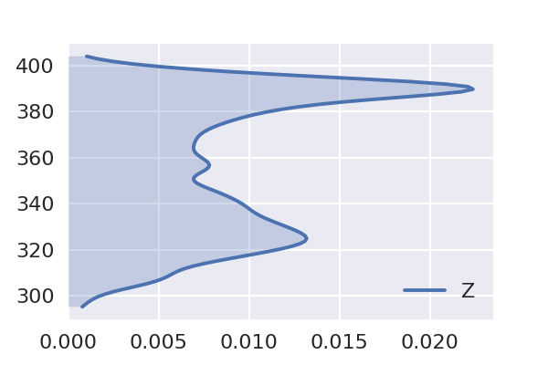
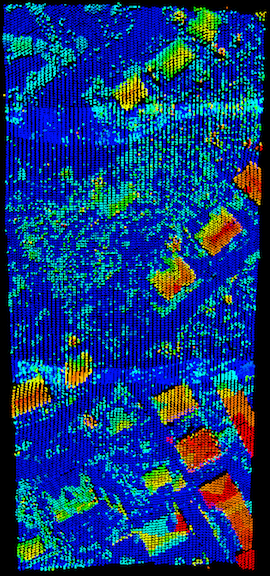

---

### Point Cloud Filters<br>& Pipelines in PDAL
#### FOSS4G 2017, 18 August 2017
Bradley J Chambers, DigitalGlobe

---

### Overview

* Docker Images
* Filter-only Pipelines
* Status of PCL Filters
* Python Package
* Python Examples

---

### Docker Images

| **Image** | **Tag** | **Size** |
|---------|-------|--------|
| [pdal/dependencies](https://hub.docker.com/r/pdal/dependencies/) | 1.5 | 3.1GB |
| [pdal/dependencies](https://hub.docker.com/r/pdal/dependencies/) | latest | 3.31GB |
| [pdal/pdal](https://hub.docker.com/r/pdal/pdal/) | 1.5 | 3.67GB |
| [pdal/pdal](https://hub.docker.com/r/pdal/pdal/) | latest | 3.67GB |

- Images building plugins on top of the PDAL base image can grow even larger |

+++

### Alpine Docker Image

* Prototype Alpine image with ~80% of the plugins

| **Image** | **Tag** | **Size** |
|---------|-------|--------|
| pdal/dependencies | alpine | 1.07GB |
| pdal/pdal | alpine | 365MB |

---

### Filter-only Pipelines

+++

```json
{
  "pipeline":[
    "input.las",
    {
      "type":"filters.whatever",
      "some":"options"
    },
    "output.laz"
  ]
}
```
@[3](Inferred reader)
@[4-7](Filter with options)
@[8](Inferred writer)

+++

```bash
pdal pipeline pipeline.json
```

+++

```bash
pdal pipeline pipeline.json --readers.las.filename=input.las --writers.las.filename=output.las
```
@[1](Override options from the CLI)

+++

```json
{
  "pipeline":[
    {
      "type":"filters.whatever",
      "some":"options"
    }
  ]
}
```

+++

```bash
pdal translate input.las output.las --json pipeline.json
```

---

### Status of PCL Filters

+++

| **Old (PCL)** | **New (PDAL)** |
|---------------|----------------|
| `filters.ground` | `filters.pmf` |
| `filters.radiusoutlier` | `filters.outlier` |
| `filters.statisticaloutlier` | `filters.outlier` |
| `filters.height` | `filters.hag` |
| `filters.dartsample` | `filters.sample` |

<p style="font-size:0.6em">Native PDAL variants of PCL Plugin filters</p>

+++

```json
{
  "pipeline": [
    {
      "type": "filters.pclblock", 
      "methods": [
        {
          "setLeafSize": {
            "y": 2.0, 
            "x": 2.0, 
            "z": 2.0
          }, 
          "name": "VoxelGrid"
        }
      ]
    }
  ]
}
```
@[5-14](PCL JSON specification bumped to v0.2 → easier to embed in PDAL JSON)

+++


+++


---

### Python Package

* The PDAL Python [package](https://pypi.python.org/pypi/PDAL) can be installed via [pip](https://pip.pypa.io/en/stable/).

  ```
  pip install pdal
  ```

* Once installed, simply

  ```python
  import pdal
  ```

---

### Python Examples

Note:
The remainder of the presentation will present examples in the context of the PDAL Python package (though CLI samples will be provided as well).

+++

### Creating a Pipeline

```python
>>> json = u'''
... {
...   "pipeline":[
...     "./data/isprs/samp11-utm.laz"
...   ]
... }'''


>>> p = pdal.Pipeline(json)
```
@[1-6](Define the pipeline JSON)
@[9](Create the pipeline)

+++

### Validating & Executing the Pipeline

```python
>>> print('Is pipeline valid? %s' % p.validate())
Is pipeline valid? True


>>> print('Pipeline processed %d points.' % p.execute())
Pipeline processed 38010 points.


>>> arr = p.arrays[0]
>>> print('Pipeline contains %d array(s).' % (len(p.arrays)))
Pipeline contains 1 array(s).
```
@[1-2](Check for a valid pipeline)
@[5-6](Execute the pipeline)
@[9-11](Check how many `ndarrays` were returned)

+++

### Use the `ndarray`

#### Print the first point record

```python
>>> print(arr[0])
```

```bash
(512743.63, 5403547.33, 308.68, 0, 1, 1, 0, 0, 2, 0.0, 0, 0)
```

+++

#### Print the first 10 X values

```python
>>> print(arr['X'][:10])
```

```bash
[ 512743.63  512743.62  512743.61  512743.6   512743.6   512741.5   512741.5
  512741.49  512741.48  512741.47]
```

+++

#### Print the mean of all Z values

```python
>>> print(arr['Z'].mean())
```

```bash
356.17143357
```

+++

### Or Pandas!

```python
>>> import pandas as pd
>>> samp11 = pd.DataFrame(arr, columns=['X','Y','Z'])
>>> samp11.head()
```

```bash
           X           Y       Z
0  512743.63  5403547.33  308.68
1  512743.62  5403547.33  308.70
2  512743.61  5403547.33  308.72
3  512743.60  5403547.34  308.68
4  512743.60  5403547.33  308.73
```

+++

```python
>>> samp11.describe()
```

```bash
                   X             Y             Z
count   38010.000000  3.801000e+04  38010.000000
mean   512767.010570  5.403708e+06    356.171434
std        38.570375  8.587360e+01     29.212680
min    512700.870000  5.403547e+06    295.250000
25%    512733.530000  5.403645e+06    329.060000
50%    512766.940000  5.403705e+06    356.865000
75%    512799.900000  5.403790e+06    385.860000
max    512834.760000  5.403850e+06    404.080000
```

+++

### Analyze

```python
>>> import seaborn as sns
>>> sns.kdeplot(samp11['Z'], cut=0, shade=True, vertical=True);
```



+++

### Searching Near a Point

#### Find the median point

```python
>>> med = samp11.median()
>>> print(med)
```

```bash
X     512766.940
Y    5403705.460
Z        356.865
dtype: float64
```

+++

#### Print the distance to the three nearest neighbors

```python
>>> from scipy import spatial
>>> tree = spatial.cKDTree(samp11)
>>> dists, idx = tree.query(med, k=3)
>>> print(dists)
```

```bash
[ 0.6213091   1.37645378  1.51757207]
```

+++

#### Print the point records of the three nearest neighbors

```python
>>> samp11.iloc[idx]
```

```bash
               X           Y       Z
31897  512767.16  5403706.02  357.02
31881  512767.93  5403706.29  356.39
31972  512765.75  5403706.19  356.27
```

+++

### DimRange

* A [DimRange](https://www.pdal.io/stages/filters.range.html#ranges) is a
  * named dimension, and 
  * range of values.
* Bounds can be inclusive (`[]`) or exclusive (`()`).
* Ranges can be negated (`!`).

+++

```json
{
  "pipeline":[
    {
      "type":"filters.range",
      "limits":"Z[10:]"
    },
    {
      "type":"filters.range",
      "limits":"Classification[2:2]"
    },
    {
      "type":"filters.range",
      "limits":"Red!(20:40]"
    },
    {
      "type":"filters.assign",
      "assignment":"Classification[:]=0"
    }
  ]
}
```
@[3-6](Select all points with Z greater than or equal to 10)
@[7-10](Select all points with classification of 2)
@[11-14](Select points with red values less than or equal to 20 as well as those greater than 40)
@[15-18](Reassign all classification values to 0)

+++

### Ignoring a `DimRange`

- Available to `filters.pmf` and `filters.smrf`
- Eliminates the need to completely remove points (e.g., noise)
- Instead, points are ignored

+++

```json
{
  "pipeline":[
    {
      "type":"filters.range",
      "limits":"Classification![7:7]"
    },
    {
      "type":"filters.smrf"
    }
  ]
}
```
@[1-11](Noise points are removed!)

+++

```json
{
  "pipeline":[
    {
      "type":"filters.smrf",
      "ignore":"Classification[7:7]"
    }
  ]
}
```
@[1-8](Noise points are left intact, just ignored.)

+++

### Height Above Ground

- `filters.hag`
- Creates new `HeightAboveGround` dimension

+++

1. [SMRF](https://pdal.io/stages/filters.smrf.html) to segment ground and non-ground returns
2. [HAG](https://pdal.io/stages/filters.hag.html) to estimate the `HeightAboveGround` using the return information.

+++

Recall the kernel density of raw elevations...


+++

```json
{
  "pipeline":[
    "./data/isprs/samp11-utm.laz",
    {
      "type":"filters.smrf"
    },
    {
      "type":"filters.hag"
    }
  ]
}
```
@[7-9](Now, consider the `HeightAboveGround` dimension)

+++

```python
>>> p = pdal.Pipeline(json)
>>> count = p.execute()
>>> df = pd.DataFrame(p.arrays[0])
>>> sns.kdeplot(df['HeightAboveGround'], cut=0, shade=True, vertical=True);
```


+++

```python
>>> df[['HeightAboveGround']].describe()
```

```bash
       HeightAboveGround
count       15607.000000
mean            5.467956
std             5.006438
min           -13.280000
25%             2.110000
50%             3.870000
75%             7.810000
max            63.700000
```
+++



+++

### Assign

- `filters.assign`
- Assign a value to a `DimRange`
- Handy for resetting classifications

+++

### Approximate Coplanar

- `filters.approximatecoplanar`
- Ratios of eigenvalues
- Creates a new binary dimension called `Coplanar`

+++

```json
{
  "pipeline":[
    "./data/isprs/samp11-utm.laz",
    {
      "type":"filters.approximatecoplanar"
    }
  ]
}
```

+++


+++

```json
{
  "pipeline":[
    "./data/isprs/samp11-utm.laz",
    {
      "type":"filters.smrf"
    },
    {
      "type":"filters.hag"
    },
    {
      "type":"filters.range",
      "limits":"HeightAboveGround[2:)"
    },
    {
      "type":"filters.approximatecoplanar"
    }
  ]
}
```

+++


+++

### Extended Local Minimum

- `filters.elm`
- Extended Local Minimum seeks to identify outliers below the ground surface
- Marks outliers with `Classification` value of 7

+++

### Estimate Rank

- `filters.estimaterank`
- Compute covariance of neighborhoods of points and estimate rank
- Potentially useful for identifying linear features, planes, etc.
- Creates new `Rank` dimension

+++

```json
{
  "pipeline":[
    "./data/isprs/samp11-utm.laz",
    {
      "type":"filters.estimaterank"
    }
  ]
}
```

+++


+++

```json
{
  "pipeline":[
    "./data/isprs/samp11-utm.laz",
    {
      "type":"filters.smrf"
    },
    {
      "type":"filters.hag"
    },
    {
      "type":"filters.range",
      "limits":"HeightAboveGround[2:)"
    },
    {
      "type":"filters.estimaterank"
    }
  ]
}
```

+++


+++

### Groupby

- `filters.groupby`
- Split the incoming PointView into separate PointViews by given criteria
- Allows us to operate on each individually (e.g., find centroid of each cluster)

+++

### Head (and Tail)

- `filters.head` and `filters.tail`
- Pass only the specified number of points from beginning or ending of the PointView

+++

### KDistance

- `filters.kdistance`
- Compute the distance to the k-th nearest neighbor
- Creates new `KDistance` dimension

+++

### Local Outlier Factor

- Local Outlier Factor
- Creates three new dimensions
  - `KDistance`
  - `LocalReachabilityDistance`
  - `LocalOutlierFactor`

+++

```json
{
  "pipeline":[
    "./data/isprs/samp11-utm.laz",
    {
      "type":"filters.lof"
    }
  ]
}
```

+++


+++

### Locate

- `filters.locate`
- Find and return only the min or max point in the incoming PointView (e.g., of a cluster)

+++

### Median Absolute Deviation

- `filters.mad`
- Filter points by evaluating Median Absolute Deviation for a given dimension

+++


+++


+++


+++

### Interquartile Rnage

- `filters.iqr`
- Filter points by evaluating Interquartile Range for a given dimension

+++


+++


+++


+++

### Clusters

- `filters.cluster`
- Cluster points by proximity (Euclidean distance)
- Iterate over newly added points until no more points can be added
- Creates a new integer dimension specifying the `ClusterID`

+++


+++

### Eigenvalues

- `filters.eigenvalues`
- Filters like `filters.approximatecoplanar` use eigenvalues, but analysts may wish to precompute eigenvalues and operate directly on them
- Creates three new dimensions
  - `Eigenvalue0`
  - `Eigenvalue1`
  - `Eigenvalue2`

+++


+++

### Radial Density

- `filters.radialdensity`
- Return the number of points within sphere of given radius
- Creates new `RadialDensity` dimension

+++

### Simple Morphological Filter

- `filters.smrf`
- New alternative to PMF, still uses morphological operators
- Marks ground points as `Classification` value of 2 (else 1)

+++

### Voxel Methods

- `filters.voxelcenternearestneighbor` and `filters.voxelcentroidnearestneighbor`
- Eventual replacement of PCL `filters.voxelgrid`
- Thins the point cloud to one point per voxel

+++

### Removing Noise

This tutorial is meant to walk through the use of and theory behind one of PDAL's `outlier` filters.

+++

### Statistical Outlier Filter

The basic idea of a statistical outlier removal has been implemented in both [PCL](http://www.pointclouds.org/documentation/tutorials/statistical_outlier.php#statistical-outlier-removal) and [PDAL](https://www.pdal.io/stages/filters.outlier.html).

+++

We begin by computing the mean distance $\mu_i$ to each of the $k$ nearest neighbors for each point.

$$\overline{\mu} = \frac{1}{N} \sum_{i=1}^N \mu_i$$

$$\sigma = \sqrt{\frac{1}{N-1} \sum_{i=1}^N (\mu_i - \overline{\mu})^2}$$

+++

A threshold is then formed by

$$\overline{\mu} + 3\sigma$$

Any point whose mean distance $\mu_i$ exceeds this threshold is then labeled as noise.

+++

Let's begin by iterating through our DataFrame, keeping track of the mean distance to our eight nearest neighbors.

```python
>>> dists = []
>>> for _, point in samp11[['X','Y','Z']].iterrows():
...     dist, _ = tree.query(point, k=9)
...     dists = np.append(dists, dist[1:].mean())
```

+++

```python
>>> sns.kdeplot(dists, cut=0, shade=True);
```


<p style="font-size:0.6em">KDE plot of mean distances.</p>

+++

Now, we compute the threshold as described.

```python
>>> threshold = dists.mean() + 3 * dists.std()
>>> noise = dists[dists > threshold]
>>> signal = dists[dists <= threshold]
>>> print(noise.size, "points detected with a mean distance exceeding the global threshold of", threshold)
```

```bash
241 points detected with a mean distance exceeding the global threshold of 3.81763516967
```

+++

```python
>>> sns.kdeplot(signal, cut=0, shade=True);
```


<p style="font-size:0.6em">Updated KDE plot after noise removal.</p>

+++

```python
import numpy as np
import pandas as pd
from scipy import spatial
def sor(ins, outs):
    dists=[]
    df = pd.DataFrame(ins, columns=['X','Y','Z'])
    tree = spatial.cKDTree(df)
    for _, point in df.iterrows():
        dist, _ = tree.query(point, k=9)
        dists = np.append(dists, dist[1:].mean())
    threshold = dists.mean() + 3 * dists.std()
    outs['Mask'] = dists <= threshold
    return True
```

+++

```json
{
  "pipeline":[
    "./data/isprs/samp11-utm.laz",
    {
      "type":"filters.python",
      "script":"noise-predicate.py",
      "function":"sor",
      "module":"anything"
    }
  ]
}
```

+++

```python
!pdal translate ./data/isprs/samp11-utm.laz ./data/foo.laz assign outlier \
  --filters.assign.assignment="Classification[:]=0" \
  --filters.outlier.method="statistical" \
  --filters.outlier.multiplier=3 \
  --filters.outlier.mean_k=8 \
  --verbose 5
```

    (pdal translate filters.outlier Debug) 		Labeled 241 outliers as noise!
    (pdal translate writers.las Debug) Wrote 38010 points to the LAS file

+++

```json
{
  "pipeline":[
    "./data/isprs/samp11-utm.laz",
    {
      "type":"filters.assign",
      "assignment":"Classification[:]=0"
    },
    {
      "type": "filters.outlier",
      "method": "statistical",
      "multiplier": 3,
      "mean_k": 8
    }
  ]
}
```

+++

```python
>>> p = pdal.Pipeline(json)
>>> p.loglevel = 8
>>> count = p.execute()
>>> print(p.log)
```

```bash
(pypipeline filters.outlier Debug)     Labeled 241 outliers as noise!
```

+++

```python
json = u'''
{
  "pipeline": [
    "./data/isprs/samp11-utm.laz",
    {
      "type": "filters.smrf"
    }, {
      "type": "filters.hag"
    }, {
      "type": "filters.range", "limits": "HeightAboveGround[3:]"
    }, {
      "type": "filters.cluster", "tolerance": 3
    }, {
      "type": "filters.groupby", "dimension": "ClusterID"
    }, {
      "type": "filters.locate", "dimension": "HeightAboveGround", "minmax": "max"
    }, {
      "type": "filters.merge"
    }, {
      "type": "filters.range", "limits": "HeightAboveGround[20:]"
    }
  ]
}

'''
>>> p = pdal.Pipeline(json)
>>> count = p.execute()
>>> vo = pd.DataFrame(p.arrays[0], columns=['X','Y','Z','HeightAboveGround'])
```

+++

```python
>>> vo.describe()
```

```bash
                   X             Y           Z  HeightAboveGround
count      15.000000  1.500000e+01   15.000000          15.000000
mean   512799.513333  5.403632e+06  352.667333          38.212000
std        23.111817  4.812817e+01   22.661835          16.576486
min    512730.790000  5.403557e+06  317.300000          20.050000
25%    512795.435000  5.403623e+06  333.970000          21.895000
50%    512798.290000  5.403624e+06  354.110000          38.450000
75%    512813.460000  5.403626e+06  367.255000          54.255000
max    512831.280000  5.403739e+06  401.930000          63.700000
```

+++

```python
>>> vo
```

```bash
            X           Y       Z  HeightAboveGround
0   512794.22  5403576.38  317.30              21.99
1   512827.97  5403630.85  329.92              24.45
2   512786.89  5403626.56  366.60              58.15
3   512811.06  5403612.84  326.88              20.26
4   512792.11  5403626.03  368.89              59.78
5   512797.05  5403624.26  338.02              28.91
6   512796.65  5403624.90  350.39              41.28
7   512798.29  5403625.87  361.53              52.31
8   512797.34  5403623.67  347.56              38.45
9   512798.47  5403623.67  354.11              44.89
10  512798.73  5403624.20  365.42              56.20
11  512831.28  5403557.39  323.52              20.96
12  512815.86  5403621.44  370.03              63.70
13  512815.99  5403739.10  367.91              20.05
14  512730.79  5403738.80  401.93              21.80
```
