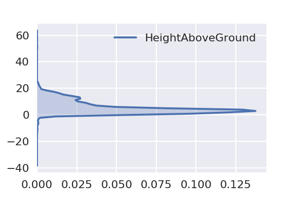
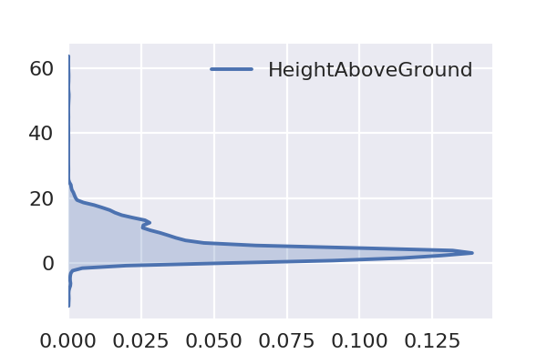
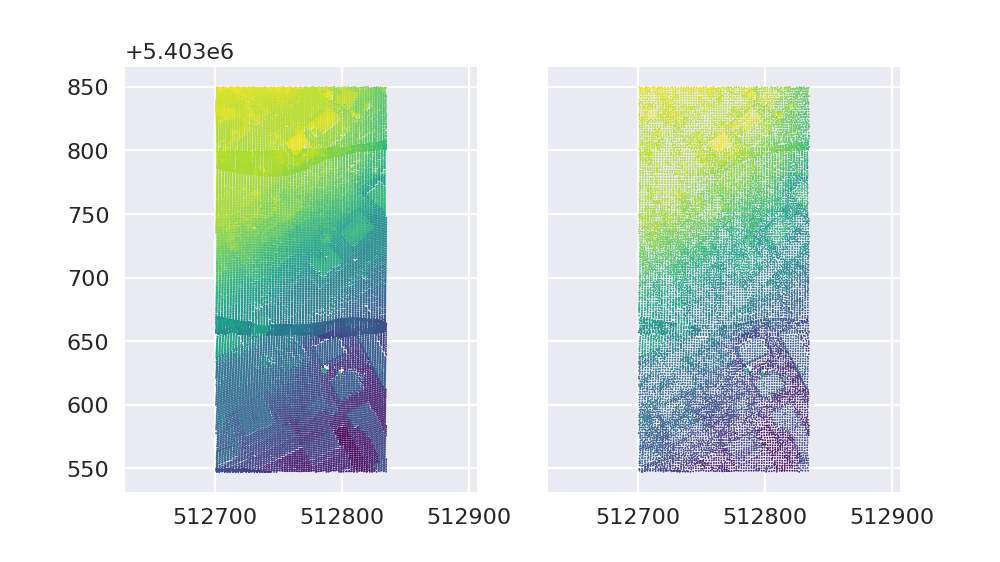
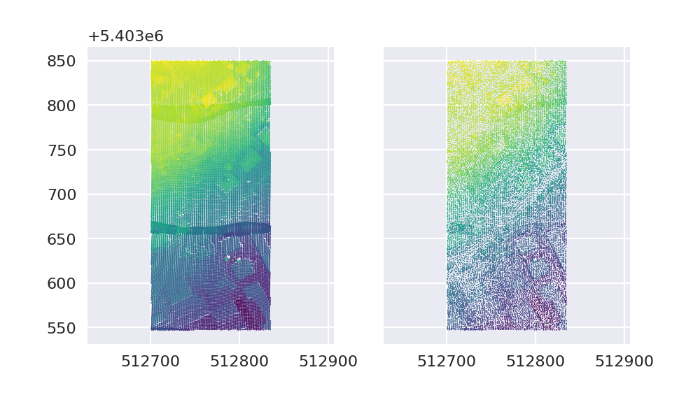
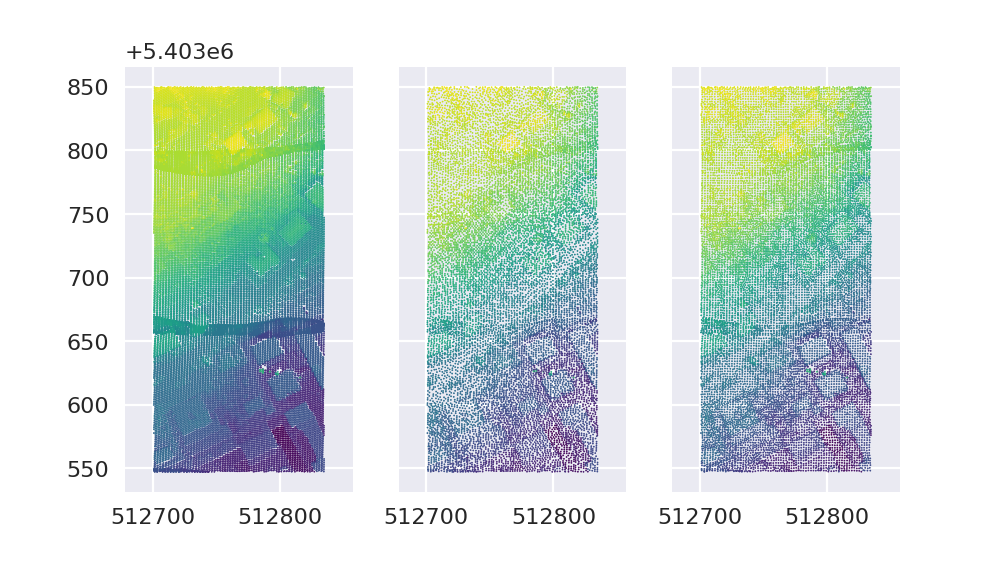

---

### Point Cloud Filters<br>& Pipelines in PDAL
#### FOSS4G 2017, 18 August 2017
Bradley J Chambers, DigitalGlobe

---

### Overview

* Python Package
* Docker Images
* IPython/Jupyter Examples
* Status of PCL Filters
* Filter-only Pipelines

---

### Python Package

* The PDAL Python [package](https://pypi.python.org/pypi/PDAL) can be installed via [pip](https://pip.pypa.io/en/stable/).

  ```
  pip install pdal
  ```

* Once installed, simply

  ```python
  import pdal
  ```

---

### Docker Image

| **Image** | **Tag** | **Size** |
|---------|-------|--------|
| [pdal/dependencies](https://hub.docker.com/r/pdal/dependencies/) | 1.5 | 3.1GB |
| [pdal/dependencies](https://hub.docker.com/r/pdal/dependencies/) | latest | 3.31GB |
| [pdal/pdal](https://hub.docker.com/r/pdal/pdal/) | 1.5 | 3.67GB |
| [pdal/pdal](https://hub.docker.com/r/pdal/pdal/) | latest | 3.67GB |

- Images building plugins on top of the PDAL base image can grow even larger |

+++

### Alpine Docker Image

* Prototype Alpine image with ~80% of the plugins

| **Image** | **Tag** | **Size** |
|---------|-------|--------|
| pdal/dependencies | alpine | 1.07GB |
| pdal/pdal | alpine | 365MB |

---

### Python Examples

Note:
The remainder of the presentation will present examples in the context of the PDAL Python package (though CLI samples will be provided as well).

+++

### Creating a Pipeline

```python
>>> json = u'''
... {
...   "pipeline":[
...     "./data/isprs/samp11-utm.laz"
...   ]
... }'''


>>> p = pdal.Pipeline(json)
```
@[1-6](Define the pipeline JSON)
@[9](Create the pipeline)

+++

### Validating & Executing the Pipeline

```python
>>> print('Is pipeline valid? %s' % p.validate())
Is pipeline valid? True


>>> print('Pipeline processed %d points.' % p.execute())
Pipeline processed 38010 points.


>>> arr = p.arrays[0]
>>> print('Pipeline contains %d array(s).' % (len(p.arrays)))
Pipeline contains 1 array(s).
```
@[1-2](Check for a valid pipeline)
@[5-6](Execute the pipeline)
@[9-11](Check how many `ndarrays` were returned)

+++

### Use the `ndarray`

#### Print the first point record

```python
>>> print(arr[0])
```

```bash
(512743.63, 5403547.33, 308.68, 0, 1, 1, 0, 0, 2, 0.0, 0, 0)
```

+++

#### Print the first 10 X values

```python
>>> print(arr['X'][:10])
```

```bash
[ 512743.63  512743.62  512743.61  512743.6   512743.6   512741.5   512741.5
  512741.49  512741.48  512741.47]
```

+++

#### Print the mean of all Z values

```python
>>> print(arr['Z'].mean())
```

```bash
356.17143357
```

+++

### Or Pandas!

```python
>>> import pandas as pd
>>> samp11 = pd.DataFrame(arr, columns=['X','Y','Z'])
>>> samp11.head()
```

```bash
           X           Y       Z
0  512743.63  5403547.33  308.68
1  512743.62  5403547.33  308.70
2  512743.61  5403547.33  308.72
3  512743.60  5403547.34  308.68
4  512743.60  5403547.33  308.73
```

+++

```python
>>> samp11.describe()
```

```bash
                   X             Y             Z
count   38010.000000  3.801000e+04  38010.000000
mean   512767.010570  5.403708e+06    356.171434
std        38.570375  8.587360e+01     29.212680
min    512700.870000  5.403547e+06    295.250000
25%    512733.530000  5.403645e+06    329.060000
50%    512766.940000  5.403705e+06    356.865000
75%    512799.900000  5.403790e+06    385.860000
max    512834.760000  5.403850e+06    404.080000
```

+++

### Analyze

```python
>>> import seaborn as sns
>>> sns.kdeplot(samp11['Z'], cut=0, shade=True, vertical=True);
```


+++

### Searching Near a Point

#### Find the median point

```python
>>> med = samp11.median()
>>> print(med)
```

```bash
X     512766.940
Y    5403705.460
Z        356.865
dtype: float64
```

+++

#### Print the distance to the three nearest neighbors

```python
>>> from scipy import spatial
>>> tree = spatial.cKDTree(samp11)
>>> dists, idx = tree.query(med, k=3)
>>> print(dists)
```

```bash
[ 0.6213091   1.37645378  1.51757207]
```

+++

#### Print the point records of the three nearest neighbors

```python
>>> samp11.iloc[idx]
```

```bash
               X           Y       Z
31897  512767.16  5403706.02  357.02
31881  512767.93  5403706.29  356.39
31972  512765.75  5403706.19  356.27
```

+++

### DimRange

* A [DimRange](https://www.pdal.io/stages/filters.range.html#ranges) is a
  * named dimension, and 
  * range of values.
* Bounds can be inclusive (`[]`) or exclusive (`()`).
* Ranges can be negated (`!`).

+++

```json
{
  "pipeline":[
    {
      "type":"filters.range",
      "limits":"Z[10:]"
    },
    {
      "type":"filters.range",
      "limits":"Classification[2:2]"
    },
    {
      "type":"filters.range",
      "limits":"Red!(20:40]"
    },
    {
      "type":"filters.assign",
      "assignment":"Classification[:]=0"
    }
  ]
}
```
@[3-6](Select all points with Z greater than or equal to 10)
@[7-10](Select all points with classification of 2)
@[11-14](Select points with red values less than or equal to 20 as well as those greater than 40)
@[15-18](Reassign all classification values to 0)

+++

### Ignore

Two of PDAL's ground segmentation filters, `filters.pmf` and `filters.smrf`, can now specify a `DimRange` via the `ignore` parameter to specify points that should be ignored during processing.

+++

A common use case for this is to ignore points that have been previously marked as noise. In prior versions of PDAL, we had to filter noise out completely prior to ground segmentation.

- In prior versions, noise was removed

```json
{
  "pipeline":[
    {
      "type":"filters.range",
      "limits":"Classification![7:7]"
    },
    {
      "type":"filters.smrf"
    }
  ]
}
```

- Which of course means those noise points are gone forever. |

+++

Now, with `ignore` we can


```json
{
  "pipeline":[
    {
      "type":"filters.smrf",
      "ignore":"Classification[7:7]"
    }
  ]
}
```

Which allows us to retain noise points without having them impact the ground segmentation step.

+++

### Height Above Ground

<div align="left">
To compute `HeightAboveGround` we will use two PDAL filters, first [SMRF](https://pdal.io/stages/filters.smrf.html) to segment ground and non-ground returns, and [HAG](https://pdal.io/stages/filters.hag.html) to estimate the `HeightAboveGround` using the return information.
</div>

Recall the kernel density of raw elevations...

+++


+++

Now, consider the `HeightAboveGround` dimension.

```json
{
  "pipeline":[
    "./data/isprs/samp11-utm.laz",
    {
      "type":"filters.smrf"
    },
    {
      "type":"filters.hag"
    }
  ]
}
```
@[7-9]

+++

```python
>>> p = pdal.Pipeline(json)
>>> count = p.execute()
>>> df = pd.DataFrame(p.arrays[0])
>>> sns.kdeplot(df['HeightAboveGround'], cut=0, shade=True, vertical=True);
```


+++

Exclude ground returns (HAG=0, by definition).

```json
{
  "pipeline":[
    "./data/isprs/samp11-utm.laz",
    {
      "type":"filters.smrf"
    },
    {
      "type":"filters.hag"
    },
    {
      "type":"filters.range",
      "limits":"Classification[1:1]"
    }
  ]
}
```
@[10-13]

+++

```python
>>> p = pdal.Pipeline(json)
>>> count = p.execute()
>>> df = pd.DataFrame(p.arrays[0])
>>> sns.kdeplot(df['HeightAboveGround'], cut=0, shade=True, vertical=True);
```



+++

```json
{
  "pipeline":[
    "./data/isprs/samp11-utm.laz",
    {
      "type":"filters.elm"
    },
    {
      "type":"filters.range",
      "limits":"Classification![7:7]"
    },
    {
      "type":"filters.smrf"
    },
    {
      "type":"filters.hag"
    },
    {
      "type":"filters.range",
      "limits":"Classification[1:1]"
    }
  ]
}
```
@[4-6](Extended Local Minimum looks for low outliers)
@[7-10](For this example, let's remove the noise points)

+++

```python
>>> p = pdal.Pipeline(json)
>>> count = p.execute()
>>> df = pd.DataFrame(p.arrays[0])
>>> sns.kdeplot(df['HeightAboveGround'], cut=0, shade=True, vertical=True);
```



+++

```python
>>> df[['HeightAboveGround']].describe()
```

```bash
       HeightAboveGround
count       15607.000000
mean            5.467956
std             5.006438
min           -13.280000
25%             2.110000
50%             3.870000
75%             7.810000
max            63.700000
```

+++

### Removing Noise

This tutorial is meant to walk through the use of and theory behind PDAL's `outlier` filter.

- Statistical Outlier Filter
- Radius Outlier Filter

+++

### Statistical Outlier Filter

The basic idea of a statistical outlier removal has been implemented in both [PCL](http://www.pointclouds.org/documentation/tutorials/statistical_outlier.php#statistical-outlier-removal) and [PDAL](https://www.pdal.io/stages/filters.outlier.html).

+++

We begin by computing the mean distance $\mu_i$ to each of the $k$ nearest neighbors for each point.

Next, we use the pointwise mean distances to compute the global mean

$$\overline{\mu} = \frac{1}{N} \sum_{i=1}^N \mu_i$$

and standard deviation

$$\sigma = \sqrt{\frac{1}{N-1} \sum_{i=1}^N (\mu_i - \overline{\mu})^2}$$

+++

A threshold is then formed by

$$\overline{\mu} + 3\sigma$$

Any point whose mean distance $\mu_i$ exceeds this threshold is then labeled as noise.

+++

Let's begin by iterating through our DataFrame, keeping track of the mean distance to our eight nearest neighbors.

```python
>>> dists = []
>>> for _, point in samp11[['X','Y','Z']].iterrows():
...     dist, _ = tree.query(point, k=9)
...     dists = np.append(dists, dist[1:].mean())
```

+++

The KDE plot of the mean distances looks something like this.

```python
>>> sns.kdeplot(dists, cut=0, shade=True);
```


Now, we compute the threshold as described.

+++

```python
>>> threshold = dists.mean() + 3 * dists.std()
>>> noise = dists[dists > threshold]
>>> signal = dists[dists <= threshold]
>>> print(noise.size, "points detected with a mean distance exceeding the global threshold of", threshold)
```

```bash
241 points detected with a mean distance exceeding the global threshold of 3.81763516967
```

+++

Now our KDE plot of mean distances looks like this.

```python
>>> sns.kdeplot(signal, cut=0, shade=True);
```


+++

```python
import numpy as np
import pandas as pd
from scipy import spatial
def sor(ins, outs):
    dists=[]
    df = pd.DataFrame(ins, columns=['X','Y','Z'])
    tree = spatial.cKDTree(df)
    for _, point in df.iterrows():
        dist, _ = tree.query(point, k=9)
        dists = np.append(dists, dist[1:].mean())
    threshold = dists.mean() + 3 * dists.std()
    outs['Mask'] = dists <= threshold
    return True
```

+++

```json
{
  "pipeline":[
    "./data/isprs/samp11-utm.laz",
    {
      "type":"filters.python",
      "script":"noise-predicate.py",
      "function":"sor",
      "module":"anything"
    }
  ]
}
```

+++

```python
!pdal translate ./data/isprs/samp11-utm.laz ./data/foo.laz assign outlier \
  --filters.assign.assignment="Classification[:]=0" \
  --filters.outlier.method="statistical" \
  --filters.outlier.multiplier=3 \
  --filters.outlier.mean_k=8 \
  --verbose 5
```

    (pdal translate filters.outlier Debug) 		Labeled 241 outliers as noise!
    (pdal translate writers.las Debug) Wrote 38010 points to the LAS file

+++

```json
{
  "pipeline":[
    "./data/isprs/samp11-utm.laz",
    {
      "type":"filters.assign",
      "assignment":"Classification[:]=0"
    },
    {
      "type": "filters.outlier",
      "method": "statistical",
      "multiplier": 3,
      "mean_k": 8
    }
  ]
}
```

+++

```python
>>> p = pdal.Pipeline(json)
>>> p.loglevel = 8
>>> count = p.execute()
>>> print(p.log)
```

```bash
(pypipeline filters.outlier Debug)     Labeled 241 outliers as noise!
```

+++

```python
json = u'''
{
  "pipeline": [
    "./data/isprs/samp11-utm.laz",
    {
      "type": "filters.smrf"
    }, {
      "type": "filters.hag"
    }, {
      "type": "filters.range", "limits": "HeightAboveGround[3:]"
    }, {
      "type": "filters.cluster", "tolerance": 3
    }, {
      "type": "filters.groupby", "dimension": "ClusterID"
    }, {
      "type": "filters.locate", "dimension": "HeightAboveGround", "minmax": "max"
    }, {
      "type": "filters.merge"
    }, {
      "type": "filters.range", "limits": "HeightAboveGround[20:]"
    }
  ]
}

'''
>>> p = pdal.Pipeline(json)
>>> count = p.execute()
>>> vo = pd.DataFrame(p.arrays[0], columns=['X','Y','Z','HeightAboveGround'])
```

+++

```python
>>> vo.describe()
```

```bash
                   X             Y           Z  HeightAboveGround
count      15.000000  1.500000e+01   15.000000          15.000000
mean   512799.513333  5.403632e+06  352.667333          38.212000
std        23.111817  4.812817e+01   22.661835          16.576486
min    512730.790000  5.403557e+06  317.300000          20.050000
25%    512795.435000  5.403623e+06  333.970000          21.895000
50%    512798.290000  5.403624e+06  354.110000          38.450000
75%    512813.460000  5.403626e+06  367.255000          54.255000
max    512831.280000  5.403739e+06  401.930000          63.700000
```

+++

```python
>>> vo
```

```bash
            X           Y       Z  HeightAboveGround
0   512794.22  5403576.38  317.30              21.99
1   512827.97  5403630.85  329.92              24.45
2   512786.89  5403626.56  366.60              58.15
3   512811.06  5403612.84  326.88              20.26
4   512792.11  5403626.03  368.89              59.78
5   512797.05  5403624.26  338.02              28.91
6   512796.65  5403624.90  350.39              41.28
7   512798.29  5403625.87  361.53              52.31
8   512797.34  5403623.67  347.56              38.45
9   512798.47  5403623.67  354.11              44.89
10  512798.73  5403624.20  365.42              56.20
11  512831.28  5403557.39  323.52              20.96
12  512815.86  5403621.44  370.03              63.70
13  512815.99  5403739.10  367.91              20.05
14  512730.79  5403738.80  401.93              21.80
```

+++

### Fun Things

```bash
$ pdal info ./data/isprs/samp11-utm.laz
{
  "filename": ".\/data\/isprs\/samp11-utm.laz",
  "pdal_version": "1.5.0 (git-version: cb82e6)",
  "stats":
  {
    "bbox":
    {
      "EPSG:4326":
      {
        "bbox":
        {
          "maxx": 9.174733985,
          "maxy": 48.78751773,
          "maxz": 404.08,
          "minx": 9.172901843,
          "miny": 48.78479165,
          "minz": 295.25
        },
        "boundary": {
   "coordinates" : [
      [
         [ 9.1729018399999998, 48.784794400000003 ],
         [ 9.1729111999999997, 48.787517729999998 ],
         [ 9.1747339799999992, 48.787514979999997 ],
         [ 9.1747245300000007, 48.784791650000003 ],
         [ 9.1729018399999998, 48.784794400000003 ]
      ]
   ],
   "type" : "Polygon"
}

      },
      "native":
      {
        "bbox":
        {
          "maxx": 512834.76,
          "maxy": 5403849.99,
          "maxz": 404.08,
          "minx": 512700.87,
          "miny": 5403547.26,
          "minz": 295.25
        },
        "boundary": {
   "coordinates" : [
      [
         [ 512700.87, 5403547.2599999998 ],
         [ 512700.87, 5403849.9900000002 ],
         [ 512834.76000000001, 5403849.9900000002 ],
         [ 512834.76000000001, 5403547.2599999998 ],
         [ 512700.87, 5403547.2599999998 ]
      ]
   ],
   "type" : "Polygon"
}

      }
    },
    "statistic":
    [
      {
        "average": 512767.0106,
        "count": 38010,
        "kurtosis": -1.278337687e+20,
        "maximum": 512834.76,
        "minimum": 512700.87,
        "name": "X",
        "position": 0,
        "skewness": 3.595245493e+21,
        "stddev": 2630.290728,
        "variance": 6918429.316
      },
      {
        "average": 5403707.591,
        "count": 38010,
        "kurtosis": -8.317960049e+19,
        "maximum": 5403849.99,
        "minimum": 5403547.26,
        "name": "Y",
        "position": 1,
        "skewness": 3.596353745e+21,
        "stddev": 27716.46396,
        "variance": 768202374.7
      },
      {
        "average": 356.1714336,
        "count": 38010,
        "kurtosis": -3.701228803e+18,
        "maximum": 404.08,
        "minimum": 295.25,
        "name": "Z",
        "position": 2,
        "skewness": 5.700196521e+17,
        "stddev": 29.25666907,
        "variance": 855.9526848
      },
      {
        "average": 0.4268350434,
        "count": 38010,
        "kurtosis": -1.912515008,
        "maximum": 1,
        "minimum": 0,
        "name": "Intensity",
        "position": 3,
        "skewness": 0.2958361823,
        "stddev": 0.4946333582,
        "variance": 0.244662159
      },
      {
        "average": 1,
        "count": 38010,
        "kurtosis": 38007,
        "maximum": 1,
        "minimum": 1,
        "name": "ReturnNumber",
        "position": 4,
        "skewness": 3.596405534e+21,
        "stddev": 0.005129284381,
        "variance": 2.630955826e-05
      },
      {
        "average": 1,
        "count": 38010,
        "kurtosis": 38007,
        "maximum": 1,
        "minimum": 1,
        "name": "NumberOfReturns",
        "position": 5,
        "skewness": 3.596405534e+21,
        "stddev": 0.005129284381,
        "variance": 2.630955826e-05
      },
      {
        "average": 0,
        "count": 38010,
        "maximum": 0,
        "minimum": 0,
        "name": "ScanDirectionFlag",
        "position": 6,
        "stddev": 0,
        "variance": 0
      },
      {
        "average": 0,
        "count": 38010,
        "maximum": 0,
        "minimum": 0,
        "name": "EdgeOfFlightLine",
        "position": 7,
        "stddev": 0,
        "variance": 0
      },
      {
        "average": 1.146329913,
        "count": 38010,
        "kurtosis": 1.384005316e+16,
        "maximum": 2,
        "minimum": 0,
        "name": "Classification",
        "position": 8,
        "skewness": 4.009763308e+15,
        "stddev": 0.989319905,
        "variance": 0.9787538744
      },
      {
        "average": 0,
        "count": 38010,
        "maximum": 0,
        "minimum": 0,
        "name": "ScanAngleRank",
        "position": 9,
        "stddev": 0,
        "variance": 0
      },
      {
        "average": 0,
        "count": 38010,
        "maximum": 0,
        "minimum": 0,
        "name": "UserData",
        "position": 10,
        "stddev": 0,
        "variance": 0
      },
      {
        "average": 0,
        "count": 38010,
        "maximum": 0,
        "minimum": 0,
        "name": "PointSourceId",
        "position": 11,
        "stddev": 0,
        "variance": 0
      }
    ]
  }
}
```

+++

```bash
$ pdal info ./data/isprs/samp11-utm.laz --boundary
{
  "boundary":
  {
    "area": 49185.59593,
    "avg_pt_per_sq_unit": 4.332144732,
    "avg_pt_spacing": 1.137548793,
    "boundary": "MULTIPOLYGON (((512735.34793786 5403532.98504758, 512843.01474565 5403547.33000000, 512834.73268351 5403877.26390560, 512718.78381359 5403877.26390560, 512685.65556504 5403848.57400076, 512685.65556504 5403561.67495242, 512735.34793786 5403532.98504758)))",
    "boundary_json": { "type": "MultiPolygon", "coordinates": [ [ [ [ 512735.34793786, 5403532.98504758 ], [ 512843.01474565, 5403547.33 ], [ 512834.73268351, 5403877.2639056 ], [ 512718.78381359, 5403877.2639056 ], [ 512685.65556504, 5403848.57400076 ], [ 512685.65556504, 5403561.67495242 ], [ 512735.34793786, 5403532.98504758 ] ] ] ] },
    "density": 0.7727872211,
    "edge_length": 0,
    "estimated_edge": 28.68990483,
    "hex_offsets": "MULTIPOINT (0 0, -8.28206 14.345, 0 28.6899, 16.5641 28.6899, 24.8462 14.345, 16.5641 0)",
    "sample_size": 5000,
    "threshold": 15
  },
  "filename": ".\/data\/isprs\/samp11-utm.laz",
  "pdal_version": "1.5.0 (git-version: cb82e6)"
}
```

+++

```bash
$ pdal info ./data/isprs/samp11-utm.laz --boundary | jq -r .boundary.boundary
MULTIPOLYGON (((512735.34793786 5403532.98504758, 512843.01474565 5403547.33000000, 512834.73268351 5403877.26390560, 512718.78381359 5403877.26390560, 512685.65556504 5403848.57400076, 512685.65556504 5403561.67495242, 512735.34793786 5403532.98504758)))
```

+++

```bash
$ pdal translate ./data/isprs/CSite1_orig-utm.laz ./data/foo.laz crop --verbose 5 \
    --filters.crop.polygon="$(pdal info ./data/isprs/samp11-utm.laz --boundary | jq -r .boundary.boundary)"
(pdal translate writers.las Debug) Wrote 95798 points to the LAS file
```

+++

### Status of PCL Filters

* Native PDAL variants of PCL Plugin filters
* PCL JSON specifcation bumped to v0.2 → easier to embed in PDAL JSON
* Removed the PCL Visualizers

+++

| **Old (PCL)** | **New (PDAL)** |
|---------------|----------------|
| `filters.ground` | `filters.pmf` |
| `filters.radiusoutlier` | `filters.outlier` |
| `filters.statisticaloutlier` | `filters.outlier` |
| `filters.height` | `filters.hag` |
| `filters.dartsample` | `filters.sample` |

+++

```json
{
  "pipeline": [
    {
      "type": "filters.pclblock", 
      "methods": [
        {
          "setLeafSize": {
            "y": 2.0, 
            "x": 2.0, 
            "z": 2.0
          }, 
          "name": "VoxelGrid"
        }
      ]
    }
  ]
}
```

+++

```bash
$ pdal translate ./data/isprs/samp11-utm.laz ./data/foo.laz --json ./pclblock.json --verbose 5
(pdal translate Debug) Plugin search path: '.'
(pdal translate Debug) Plugin search path: './lib'
(pdal translate Debug) Plugin search path: '../lib'
(pdal translate Debug) Plugin search path: './bin'
(pdal translate Debug) Plugin search path: '../bin'
(pdal translate Debug) Plugin search path: '/usr/lib'
(pdal translate Debug) Attempting to load plugin '/usr/lib/libpdal_plugin_filter_pclblock.so'.
(pdal translate Debug) Loaded plugin '/usr/lib/libpdal_plugin_filter_pclblock.so'.
(pdal translate Debug) Initialized plugin '/usr/lib/libpdal_plugin_filter_pclblock.so'.
(pdal translate filters.pclblock Debug)     Process PCLBlock...
  leaf size: 2.000000, 2.000000, 2.000000
  (pdal translate writers.las Warning) ./data/foo.laz: Found invalid value of '0' for point's return number.
  (pdal translate writers.las Warning) ./data/foo.laz: Found invalid value of '0' for point's number of returns.
  (pdal translate writers.las Debug) Wrote 16721 points to the LAS file
```

+++

```json
{
  "pipeline":[
    "./data/foo.laz"
  ]
}
```

```python
p = pdal.Pipeline(json)
count = p.execute()
vg = p.arrays[0]
after = vg
```

```json
{
  "pipeline":[
    "./data/isprs/samp11-utm.laz"
  ]
}
```

```python
p = pdal.Pipeline(json)
count = p.execute()
before = p.arrays[0]
```

+++



+++

### Filter-only Pipelines

<div align="left">
We can now do filter-only pipelines. Why is that important? Well, you could always create the pipeline, and do substitution:
</div>

```bash
pdal pipeline pipeline.json --readers.las.filename=input.las --writers.las.filename=output.las
```

+++

Is now.

```bash
pdal translate input.las output.las --json pipeline.json
```

+++

### Possible comparison to earlier voxel grid

```python
%matplotlib inline
import pdal
import matplotlib.pyplot as plt
import numpy as np
json = u'''
{
  "pipeline":[
    "./data/isprs/samp11-utm.laz",
    {
      "type":"filters.sample",
      "radius":1.41
    }
  ]
}'''

p = pdal.Pipeline(json)
p.validate()
count = p.execute()
poisson = p.arrays[0]
    
json = u'''
{
  "pipeline":[
    "./data/isprs/samp11-utm.laz"
  ]
}'''

p = pdal.Pipeline(json)
p.validate()
count = p.execute()
before = p.arrays[0]
after = poisson
```

+++



+++



+++

### Need to Know

- `filters.programmable` and `filters.predicate` are now `filters.python`
- New MATLAB plugin in master
